    

    <b>Automatic Architecture Diagrams from Code</b> 
    <a href="https://github.com/swark-io/swark">GitHub</a> • <a href="https://swark.io">Website</a> • <a href="mailto:contact@swark.io">Contact Us</a>

## Usage Instructions

1. **Render the Diagram**: Use the links below to open it in Mermaid Live Editor, or install the [Mermaid Support](https://marketplace.visualstudio.com/items?itemName=bierner.markdown-mermaid) extension.
2. **Recommended Model**: If available for you, use `claude-3.5-sonnet` [language model](vscode://settings/swark.languageModel). It can process more files and generates better diagrams.
3. **Iterate for Best Results**: Language models are non-deterministic. Generate the diagram multiple times and choose the best result.

## Generated Content
**Model**: GPT-4o - [Change Model](vscode://settings/swark.languageModel)  
**Mermaid Live Editor**: [View](https://mermaid.live/view#pako:eNqVlk1v4jAQhv8K8rmXQNldcYNaW60EK0RKe0GyTDIk7iZ21h9CqOp_XychXRJsSDgEmHk8HnvmtfOBIhEDmqEdTyQt0tEL3vGR_Sizrw0rFknxk3HKI6hdLTde_DdWjgIbmPP4SWQZRBriea4DsgFlMn2fPINBl3wGjSnLTnbEBgohtcJU06Fh2-CaSs1BYtA2ctvVrBkvAoJBscRyXsKR61JQvtpLtWRKjz1ZdrDgxtIvucmwcB6sXrTyQ_7d_jGI_j6I_jaIng6iHwfRk0H0eBAd-FrJ02tbBXIpkrbxJS9Ck-cgT_UEZfwrYgMRsEJf2csWUAsa_dkWznGl3-rHi4SaHg42JcYd9u5ehFDqsE72nKtvK27Dbva8RmUlv6anHLhWPWfpMbI7sNq4GvJr543pFEt6bLTYnwz6ifuGWhzYtB_22A-b9MPG_bCgH3aHmjqxkiBlF1-b2xarvWcpTNG2LqS98dK2bb7czE38bpQuu6UjY8j3l8oFHjuuy9eVvW67KVWyKXthIzJ4ZXCsIAcT2tNhu_Y4fvF-Ij0fSKR1fLiRi3Z3A9Uh5wJ-w9FxGFTxSHO6uHy2pFaOF1eULwBmam863hXlNIGyNGQexzaF8xXfpp5SyhNYv2FXvT27XxeX1F8epuohUj3VvTYII1mePO0A73-NrQfJuwXjhRSJBNXBE8likomIZkCgW_s6PpFwAAn2ze1uRq80YzHVTHQjQWQk0yeX3xOp2R51te_NPVg-1oJdSugrVvUDPSDbmzllsX01_dghndqy7tBstEMxHGipdfRpIVPYnAAzaqfO0UxLAw-IGi3CE4-a_7YiSYpmB5op-PwHWstNRw) | [Edit](https://mermaid.live/edit#pako:eNqVlk1v4jAQhv8K8rmXQNldcYNaW60EK0RKe0GyTDIk7iZ21h9CqOp_XychXRJsSDgEmHk8HnvmtfOBIhEDmqEdTyQt0tEL3vGR_Sizrw0rFknxk3HKI6hdLTde_DdWjgIbmPP4SWQZRBriea4DsgFlMn2fPINBl3wGjSnLTnbEBgohtcJU06Fh2-CaSs1BYtA2ctvVrBkvAoJBscRyXsKR61JQvtpLtWRKjz1ZdrDgxtIvucmwcB6sXrTyQ_7d_jGI_j6I_jaIng6iHwfRk0H0eBAd-FrJ02tbBXIpkrbxJS9Ck-cgT_UEZfwrYgMRsEJf2csWUAsa_dkWznGl3-rHi4SaHg42JcYd9u5ehFDqsE72nKtvK27Dbva8RmUlv6anHLhWPWfpMbI7sNq4GvJr543pFEt6bLTYnwz6ifuGWhzYtB_22A-b9MPG_bCgH3aHmjqxkiBlF1-b2xarvWcpTNG2LqS98dK2bb7czE38bpQuu6UjY8j3l8oFHjuuy9eVvW67KVWyKXthIzJ4ZXCsIAcT2tNhu_Y4fvF-Ij0fSKR1fLiRi3Z3A9Uh5wJ-w9FxGFTxSHO6uHy2pFaOF1eULwBmam863hXlNIGyNGQexzaF8xXfpp5SyhNYv2FXvT27XxeX1F8epuohUj3VvTYII1mePO0A73-NrQfJuwXjhRSJBNXBE8likomIZkCgW_s6PpFwAAn2ze1uRq80YzHVTHQjQWQk0yeX3xOp2R51te_NPVg-1oJdSugrVvUDPSDbmzllsX01_dghndqy7tBstEMxHGipdfRpIVPYnAAzaqfO0UxLAw-IGi3CE4-a_7YiSYpmB5op-PwHWstNRw)

```mermaid
graph TD
    subgraph MicroFinance
        subgraph DB
            spDueAndCollectedAmt1_Result
            spDueAndCollectedAmt_Result1
            spGetDailyDueReportsData_Result
            spDueAndCollectedAmt_Result
            PartnerDetail
            MicroFinDB1_Designer
            MicroFinDB1
            spGetLoanMbrsList2_Result
            spGetLoanMbrsList1_Result1
            spGetLoanMbrsList3_Result
            spGetLoanMbrsList1_Result
            spGetLoanDetails_Result
            spGetDailyDueReportsData_Result8
            spGetDailyDueReportsData_Result7
            spGetDailyDueReportsData_Result6
            spGetDailyDueReportsData_Result5
            spGetDailyDueReportsData_Result4
            spGetDailyDueReportsData_Result3
            spGetDailyDueReportsData_Result2
            spGetDailyDueReportsData_Result1
            MicroFinDB_Designer
            UserLog
            TmpSummeryReportData
            TmpReceipt
            TmpLoansBackUpData
            TmpLoanColsBackUpData
            StaffLogin
            Staff
            spSelectSummerReportDta_Result1
            spSelectSummerReportDta_Result
            spSelectReceiptsAndPaymentsReportDta_Result1
            spSelectReceiptsAndPaymentsReportDta_Result
            spLoansReport_Result
            spGetWithDrawMbrsList_Result
            spGetWithDrawMbrsList1_Result
            spGetLoanMbrsList_Result6
            spGetLoanMbrsList_Result5
            spGetLoanMbrsList_Result4
            spGetLoanMbrsList_Result3
            spGetLoanMbrsList_Result2
            spGetLoanMbrsList_Result1
            spGetLoanMbrsList_Result
            spGetLoanMbrsList5_Result
            Loan_Cols
            Loan
            FinGroup
            Branch
            ALRAudjustment
            Member
        end
        subgraph VModels
            StaffWithRoleViewModel
            StaffSignUP
            StaffSignIn
            StaffLogin
            Reports_SummeryReport
            Reports_LoansReport
            Reports_DailyReport
            NewStaff
            Loans_LoanCols
            Loans_MbrAndLoanDetails
            Loans_LoanDisbus
            Management_AddNewPartner
            ChangePWD
            BranchViewModel
            Member_MemberViewModel
            Group_Groups
        end
        subgraph Scripts
            jquery_min
            nprogress
            grid_locale_en
            Scripts_references
        end
        subgraph Validation
            SecurityValidation
        end
        subgraph ViewModels
            ChartsData_DataPoint
        end
    end
```

